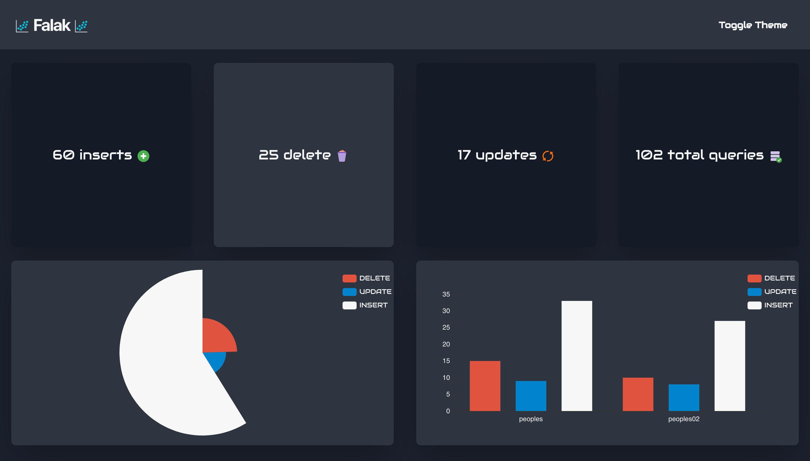
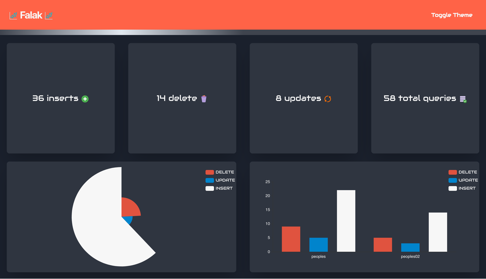

# 🌑 Falak 🌑
A real-time dashboard for CRUD operations that happened in MySQL +8 ( react + express [TypeScript] )

## Information

- you need to install this app locally to run it
- you need to have MySQL +8
- the app has 2 parts a restful API with a websocket server via [erela](https://mohammedal-rowad.github.io/Erela/#/) and a frontend application with [react](https://reactjs.org/) and [redux toolkit](https://redux-toolkit.js.org/)

Example


- when the websocket connection gets lost...



## Install

```bash
$ git clone https://github.com/MohammedAl-Rowad/Falak.git
$ cd Falak
```

To run the backend 
- rename `.env.example` to `.env` -I know you understand what to do there :)

```bash
$ cd falak-api
$ npm i
$ npm run dev
```

To run the frontend

```bash
$ cd falak-react
$ npm i
$ npm run start
```


## How dose it work
The backend reads MySQL's [binary logs](https://dev.mysql.com/doc/internals/en/binary-log-overview.html) and emit a websocket events to the frontend you can check `falak-api/src/services/mysql.service.ts` for the logic 

## Note about MySQL +5
You can run this app using MySQL +5 but you need to enable binary logs.